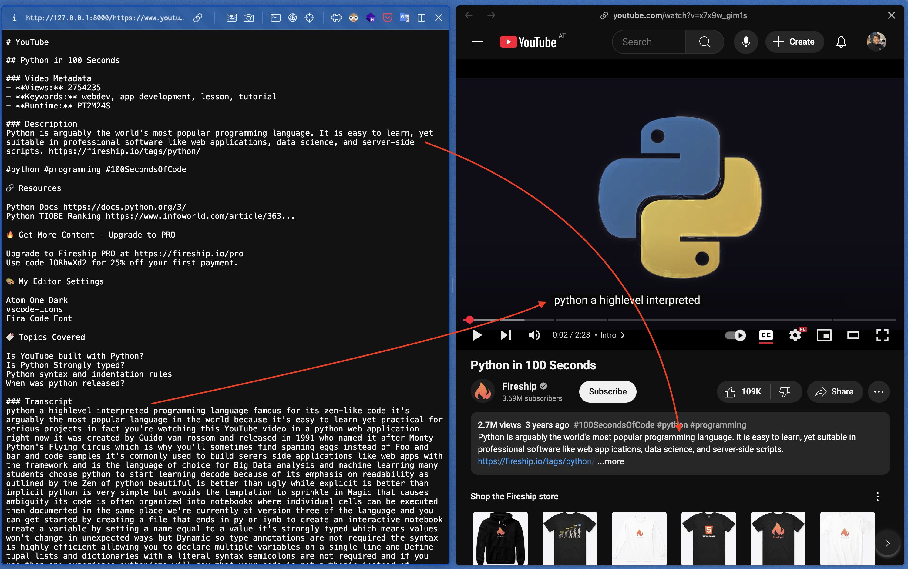
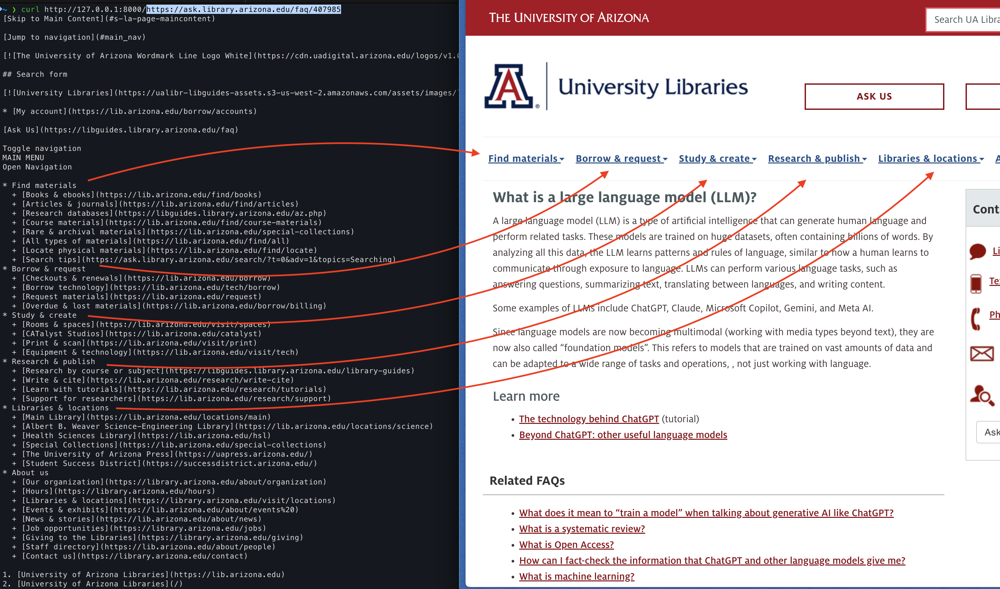
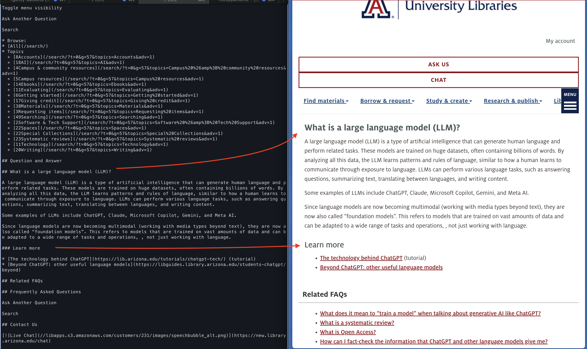

# URL to Markdown API

A powerful FastAPI service that converts web content from URLs into clean, readable Markdown format, with robust data scraping capabilities. This service excels at extracting multimedia content (such as transcripts or video info from YouTube videos and websites) and converts them into accessible markdown format. Built using Microsoft's MarkItDown library, it provides a simple HTTP API endpoint for converting various web content types. By converting content to Markdown, it makes web content more accessible and structured for Large Language Models (LLMs) and text analysis tasks.





## Live Demo

Try the live free demo at [markdown.nimk.ir](https://markdown.nimk.ir)

### Example 1: Converting a Web Article

```
GET https://markdown.nimk.ir/https://ask.library.arizona.edu/faq/407985
```

This will convert the library FAQ article into clean, readable Markdown format.

### Example 2: Converting a YouTube Video

```
GET https://markdown.nimk.ir/https://www.youtube.com/watch?v=dQw4w9WgXcQ
```

This will extract the video title, description, and other metadata in Markdown format.

## Features

- Convert web pages to clean Markdown optimized for LLM processing
- Support for various content types including:
  - Web articles and HTML content
  - YouTube videos
  - PDF documents
  - PowerPoint presentations
  - Word documents
  - Excel spreadsheets
  - Images (with EXIF metadata and OCR)
  - Audio files (with metadata and transcription)
  - Text-based formats (CSV, JSON, XML)
  - ZIP files (processes contents)
- Automatic URL protocol handling
- Clean error handling with appropriate HTTP status codes

## Why Markdown for LLMs?

- **Structured Format**: Markdown provides a clean, hierarchical structure that LLMs can easily parse and understand
- **Consistent Representation**: Different content types are normalized into a unified text format
- **Preserved Semantics**: Headers, lists, and emphasis are maintained in a way that preserves document structure
- **Reduced Noise**: Removes unnecessary formatting and styling, focusing on content
- **Enhanced Accessibility**: Makes content more accessible for text analysis and natural language processing

## Installation

### Standard Installation

1. Clone the repository
2. Install dependencies:

```bash
pip install -r requirements.txt
```

### Docker Deployment

1. Using Docker Compose (Recommended)

```bash
docker-compose up -d
```

This will build and start the service in detached mode. The API will be available at `http://localhost:8000`

2. Using Docker directly

```bash
# Build the image
docker build -t url-to-markdown .

# Run the container
docker run -d -p 8000:8000 url-to-markdown
```

## Usage

Start the server:

```bash
uvicorn main:app --reload
```

The API will be available at `http://localhost:8000`

### API Endpoint

```
GET /{url}
```

The URL should be URL-encoded if it contains special characters.

### Example Use Cases

1. **Converting YouTube Videos**

   ```
   GET http://localhost:8000/www.youtube.com/watch?v=dQw4w9WgXcQ
   ```

   This will return the video title, description, and metadata in Markdown format.

2. **Converting PDF Documents**

   ```
   GET http://localhost:8000/https://pdfobject.com/pdf/sample.pdf
   ```

   This will convert the PDF content into readable Markdown text.

3. **Converting Web Articles**
   ```
   GET http://localhost:8000/https://dev.to/iw4p/scraping-tweets-without-twitter-api-and-free-5g9c
   ```
   This will convert the article content into clean Markdown format.

### Response Format

Successful response: Plain text Markdown content

```markdown
# Article Title

## Content

[Article content in Markdown format]
```

### Error Responses

- `400`: URL processing failed
- `415`: Unsupported URL format
- `500`: Internal server error

## Development

This project uses:

- FastAPI for the web framework
- MarkItDown for content conversion
- Python 3.12+

## License

MIT License
